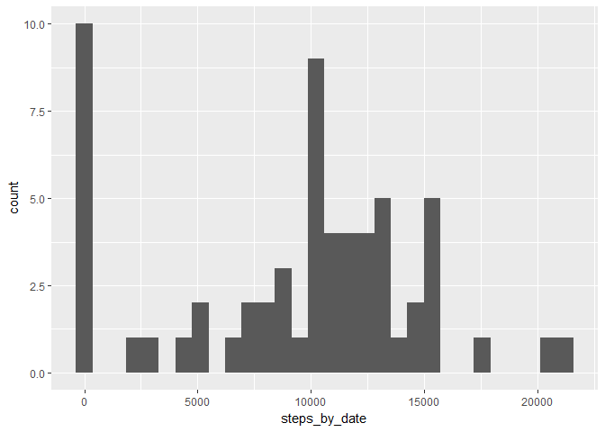
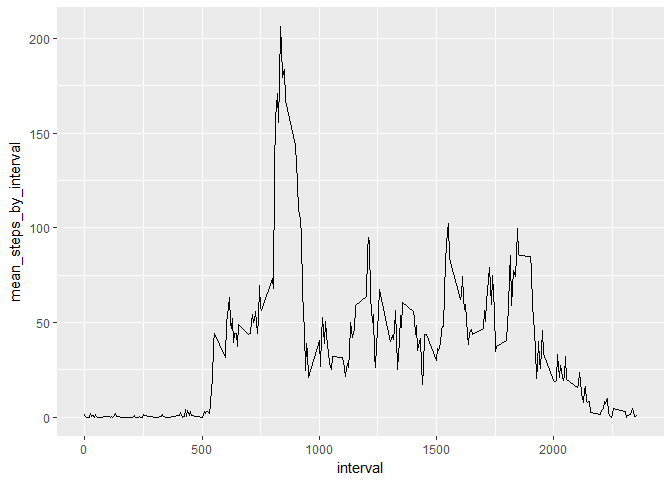
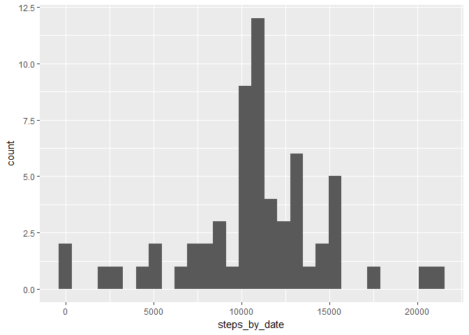
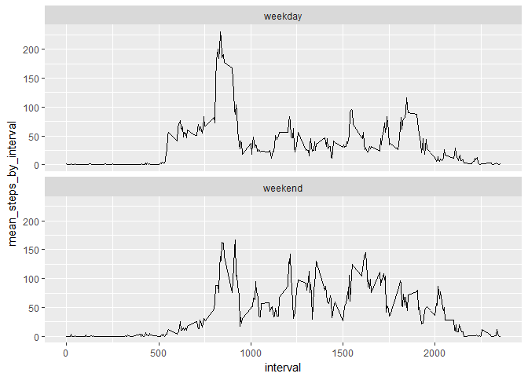

## Load the libraries

```r
library(dplyr)
library(lubridate)
library(ggplot2)
```

## Loading and preprocessing the data
1. Load the data

```r
activity_df <- read.csv('activity/activity.csv')
head(activity_df)
```

```
##   steps       date interval
## 1    NA 2012-10-01        0
## 2    NA 2012-10-01        5
## 3    NA 2012-10-01       10
## 4    NA 2012-10-01       15
## 5    NA 2012-10-01       20
## 6    NA 2012-10-01       25
```

```r
str(activity_df)
```

```
## 'data.frame':	17568 obs. of  3 variables:
##  $ steps   : int  NA NA NA NA NA NA NA NA NA NA ...
##  $ date    : Factor w/ 61 levels "2012-10-01","2012-10-02",..: 1 1 1 1 1 1 1 1 1 1 ...
##  $ interval: int  0 5 10 15 20 25 30 35 40 45 ...
```

2. Turn date from factor to date

```r
activity_df$date <- ymd(activity_df$date)
str(activity_df)
```

```
## 'data.frame':	17568 obs. of  3 variables:
##  $ steps   : int  NA NA NA NA NA NA NA NA NA NA ...
##  $ date    : Date, format: "2012-10-01" "2012-10-01" ...
##  $ interval: int  0 5 10 15 20 25 30 35 40 45 ...
```

```r
summary(activity_df)
```

```
##      steps             date               interval     
##  Min.   :  0.00   Min.   :2012-10-01   Min.   :   0.0  
##  1st Qu.:  0.00   1st Qu.:2012-10-16   1st Qu.: 588.8  
##  Median :  0.00   Median :2012-10-31   Median :1177.5  
##  Mean   : 37.38   Mean   :2012-10-31   Mean   :1177.5  
##  3rd Qu.: 12.00   3rd Qu.:2012-11-15   3rd Qu.:1766.2  
##  Max.   :806.00   Max.   :2012-11-30   Max.   :2355.0  
##  NA's   :2304
```


## What is mean total number of steps taken per day?
1. Histogram of total steps taken per day

```r
activity_by_date <- activity_df %>%
    group_by(date) %>%
    summarise(steps_by_date = sum(steps, na.rm = T))
ggplot(data = activity_by_date, aes(x = steps_by_date)) +
    geom_histogram(bins = 30)
```

<!-- -->

2. Mean and median of total steps taken per day

```r
activity_by_date %>% 
    summarise(mean_total_daily_steps = mean(steps_by_date),
              median_total_daily_steps = median(steps_by_date))
```

```
## # A tibble: 1 x 2
##   mean_total_daily_steps median_total_daily_steps
##                    <dbl>                    <int>
## 1                9354.23                    10395
```

## What is the average daily activity pattern?
1. Time series plot of the mean steps per interval

```r
activity_by_interval <- activity_df %>%
    group_by(interval) %>%
    summarise(mean_steps_by_interval = mean(steps, na.rm = T))
ggplot(data = activity_by_interval, aes(x=interval, y=mean_steps_by_interval)) +
           geom_line()
```

<!-- -->

2. The interval with the most mean steps

```r
activity_by_interval %>%
    filter(mean_steps_by_interval == max(mean_steps_by_interval))
```

```
## # A tibble: 1 x 2
##   interval mean_steps_by_interval
##      <int>                  <dbl>
## 1      835               206.1698
```

## Imputing missing values
1. Total number of missing values in the steps column

```r
sum(is.na(activity_df$steps))
```

```
## [1] 2304
```

2. Impute the missing values by the mean value for each interval

```r
activity_imputed <- activity_df %>%
    left_join(activity_by_interval, by = "interval") %>%
    mutate(steps_imputed = if_else(is.na(steps), 
                                   mean_steps_by_interval,
                                   as.numeric(steps))) %>%
    select(date, interval, everything())
head(activity_imputed)
```

```
##         date interval steps mean_steps_by_interval steps_imputed
## 1 2012-10-01        0    NA              1.7169811     1.7169811
## 2 2012-10-01        5    NA              0.3396226     0.3396226
## 3 2012-10-01       10    NA              0.1320755     0.1320755
## 4 2012-10-01       15    NA              0.1509434     0.1509434
## 5 2012-10-01       20    NA              0.0754717     0.0754717
## 6 2012-10-01       25    NA              2.0943396     2.0943396
```

3. Histogram of total steps taken per day after imputation

```r
activity_imputed_by_date <- activity_imputed %>%
    group_by(date) %>%
    summarise(steps_by_date = sum(steps_imputed))
ggplot(data = activity_imputed_by_date, aes(x=steps_by_date)) +
    geom_histogram(bins=30)
```

<!-- -->

4. Mean and median of total daily steps

```r
activity_imputed_by_date %>%
    summarise(mean_total_daily_steps = mean(steps_by_date),
              median_total_daily_steps = median(steps_by_date))
```

```
## # A tibble: 1 x 2
##   mean_total_daily_steps median_total_daily_steps
##                    <dbl>                    <dbl>
## 1               10766.19                 10766.19
```

So, before and after the imputation, the results of the mean and the median of total daily steps are different. The imputation increases the estimates for the total daily steps.

## Are there differences in activity patterns between weekdays and weekends?

```r
# Create the new factor wday
activity_imputed <- activity_imputed %>%
    mutate(wday_temp = weekdays(date),
           wday = if_else(wday_temp %in% c("Saturday", "Sunday"),
                           "weekend", "weekday")) %>%
    select(-wday_temp)


# Plot the activity patterns faceted by wday
activity_imputed %>%
    group_by(wday, interval) %>%
    summarise(mean_steps_by_interval = mean(steps_imputed)) %>%
    ggplot(aes(x=interval, y=mean_steps_by_interval)) +
           geom_line() +
    facet_wrap(~ wday, nrow = 2)
```

<!-- -->

So, the activity patterns in the weekends and the weedays are different. In the weekday, there are more activities in the earlier of the day, then less during the day. Maybe, people do exercises in the morning, then they go to work where they walk less. In the weekend, the activity pattern are more even during the day. Maybe, people have events or do housework during the weekend.
